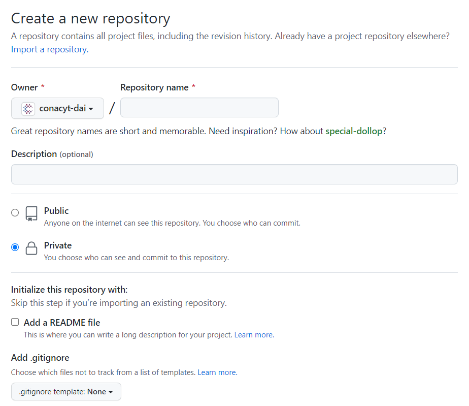
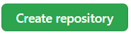
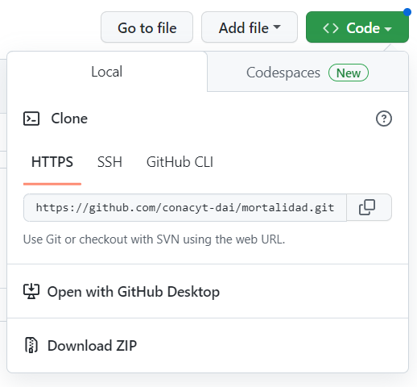

## Justificación

El objetivo de este sitio web es mostrar el proceso de trabajo que se recomienda seguir con la finalidad de comprender el flujo de trabajo que va desde la creación del repositorio hasta la estructura de carpetas y archivos mínimos que se deben tener en cuenta para el desarrollo de un proyecto-repositorio de datos del istema de Diseño y Accesibilidad para la Investigación (SISDAI) del Consejo Nacional de Ciencia y tecnología (Conacyt).

## 1) Creación de repositorio

La ruta para dirijirte a la creación de un repositorio dentro del SISDAI del Conacyt es la siguiente: 
[repositorios conacyt-sisdai](https://github.com/conacyt-dai).

Para crear un repositorio en github, debemos ir a la página de github y hacer click en el botón de "New repository".


Una vez que hayas hecho click en el botón de "New repository", se nos desplegará una ventana en la que se nos pedirá que llenemos los siguientes campos:




| Variable            | Descripcion            | Obligatorio |
|:-------------       |:------------------     |:------------|
| **Repository name** | Nombre del repositorio | Sí          |
| **Description** | Descripción del repositorio   | No, aunque es deseable |
| **Public/Private** | Si el repositorio será público o privado | Sí, por el momento todos serán privados |
| **Initialize this repository with a README** | Iniciar el repositorio con archivo README.md.  |Opcional |
| **Add .gitignore** | Si se desea agregar un archivo .gitignore | Opcional |
| **Add a license**  | Si se desea agregar una licencia | Opcional|


***Nota(1)***: Es recomendable llenar el campo de "Descripción" para que las demás personas usuarias puedan saber de qué trata el repositorio; la descripción puede ser corta si aún no estamxs segurxs de qué trata completamente el repositorio.

***Nota(2)***: Si se desea agregar un archivo .gitignore o una licencia, se puede hacer después de haber creado el repositorio.

Una vez que se hayan llenado los campos, se debe hacer click en el botón de "Create repository".



## 2) Clonar repositorio

Para clonar un repositorio de manera local, debes ir a la página de github y hacer click en el botón de "Clone or download".

Una vez que hayas hecho click en el botón de "Clone or download", se nos desplegará una ventana en la que se nos pedirá que llenemos los siguientes campos:

- **Clone with HTTPS**: Si se desea clonar el repositorio con HTTPS.
- **Clone with SSH**: Si se desea clonar el repositorio con SSH.
- **Use GitHub Desktop**: Si se desea clonar el repositorio con GitHub Desktop.

Se recomienda clonar el repositorio con HTTPS, ya que es más sencillo de configurar.

Una vez que se hayan llenado los campos, se debe hacer click en el botón de "Clone or download".



## 3) Iniciar a construir un repositorio

Despúes de contar con el repositorio creado y clonado, se puede empezar a construir el repositorio.

Para empezar a construir las carpetas y archivos del repositorio, se recomienda abrir el proyecto con el editor de código fuente que manejes (VS Code, Atom, Sublime Text, etc.).

Una vez que se haya abierto el proyecto con el editor de código fuente, se recomienda llevar a cabo los siguientes procesos a partir de una terminal.

Podemos observar que, por el momento, únicamente contamos con la rama "main".


## 4) Flujo de git (Gitflow)

### Creación de rama develop

Para crear la rama de develop, se debe ejecutar el siguiente comando:

```bash
git checkout -b develop
```

### Creación de tag

Para crear el tag, se debe ejecutar el siguiente comando:

```bash
git tag -a v0.0.0 -m "Versión inicial"
```

Etiquetas para la creación de nuevas ramas:

- **v0.0.0**: Versión inicial.
- **v0.1.0**: Versión de desarrollo.
- **v1.0.0**: Versión estable.


**¿cuándo usar "feature", "hotfix" o "release" para crear mis ramas?**

- **feature**: Cuando se esté trabajando en una nueva característica.
- **hotfix**: Cuando se esté trabajando en un error crítico.
- **release**: Cuando se esté trabajando en una nueva versión.

**¿cuál es la diferencia entre "release" y "hotfix"?**

Un lanzamiento ("release") es una versión completa y estable del software que se anuncia ampliamente, mientras que un "hotfix" es una solución rápida para un problema específico que se distribuye rápidamente sin la misma prueba exhaustiva.


### Estructura de carpetas y archivos

#### Estructura de carpetas

(Lo que mínimamente debe llevar un proyecto-repositorio)

```bash
.
├── README.md
├── data
│   ├── 
│   ├── 
│   ├── 
│   └── 
├── documentacion
│   ├── 
│   ├── 
│   └── 
├── notebooks (para procesos que sólo se ejecutan una vez)
├── 
├── 
│   ├── 
│   └── 
└── modulos (para procesos que se ejecutan más de una vez; por ejemplo, funciones)
    ├── 
    ├── 
    ├── 
    └── 
├── requirements.txt
├── pipfile
├── piplock

```

#### Estructura de archivos


Text can be **bold**, _italic_, or ~~strikethrough~~.

[Link to another page](./another-page.html).

There should be whitespace between paragraphs.

There should be whitespace between paragraphs. We recommend including a README, or a file with information about your project.

# Header 1

This is a normal paragraph following a header. GitHub is a code hosting platform for version control and collaboration. It lets you and others work together on projects from anywhere.

## Header 2

> This is a blockquote following a header.
>
> When something is important enough, you do it even if the odds are not in your favor.

### Header 3

```js
// Javascript code with syntax highlighting.
var fun = function lang(l) {
  dateformat.i18n = require('./lang/' + l)
  return true;
}
```

```ruby
# Ruby code with syntax highlighting
GitHubPages::Dependencies.gems.each do |gem, version|
  s.add_dependency(gem, "= #{version}")
end
```

#### Header 4

*   This is an unordered list following a header.
*   This is an unordered list following a header.
*   This is an unordered list following a header.

##### Header 5

1.  This is an ordered list following a header.
2.  This is an ordered list following a header.
3.  This is an ordered list following a header.

###### Header 6

| head1        | head two          | three |
|:-------------|:------------------|:------|
| ok           | good swedish fish | nice  |
| out of stock | good and plenty   | nice  |
| ok           | good `oreos`      | hmm   |
| ok           | good `zoute` drop | yumm  |

### There's a horizontal rule below this.

* * *

### Here is an unordered list:

*   Item foo
*   Item bar
*   Item baz
*   Item zip

### And an ordered list:

1.  Item one
1.  Item two
1.  Item three
1.  Item four

### And a nested list:

- level 1 item
  - level 2 item
  - level 2 item
    - level 3 item
    - level 3 item
- level 1 item
  - level 2 item
  - level 2 item
  - level 2 item
- level 1 item
  - level 2 item
  - level 2 item
- level 1 item

### Small image


### Large image


### Definition lists can be used with HTML syntax.

<dl>
<dt>Name</dt>
<dd>Godzilla</dd>
<dt>Born</dt>
<dd>1952</dd>
<dt>Birthplace</dt>
<dd>Japan</dd>
<dt>Color</dt>
<dd>Green</dd>
</dl>

```
Long, single-line code blocks should not wrap. They should horizontally scroll if they are too long. This line should be long enough to demonstrate this.
```

```
The final element.
```
